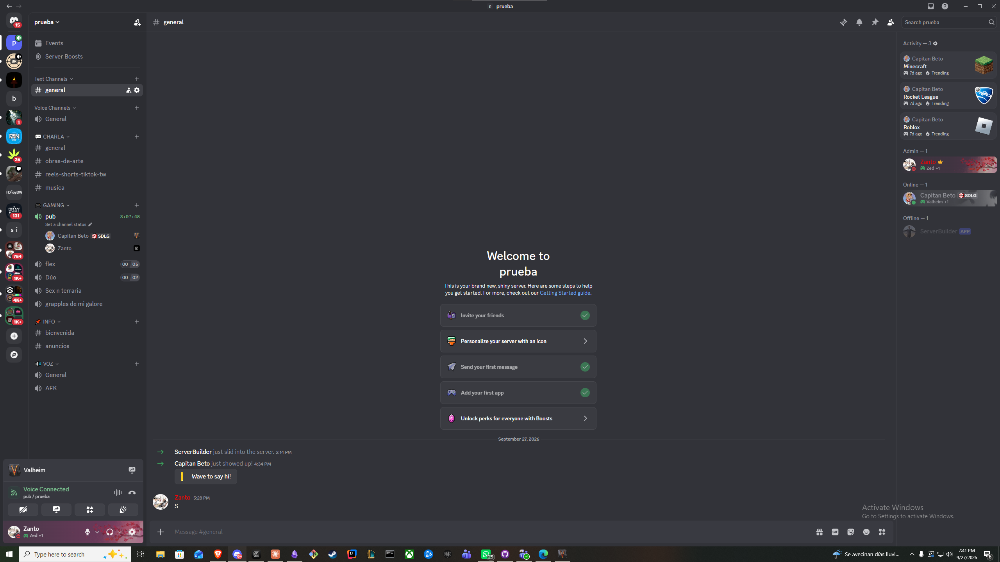
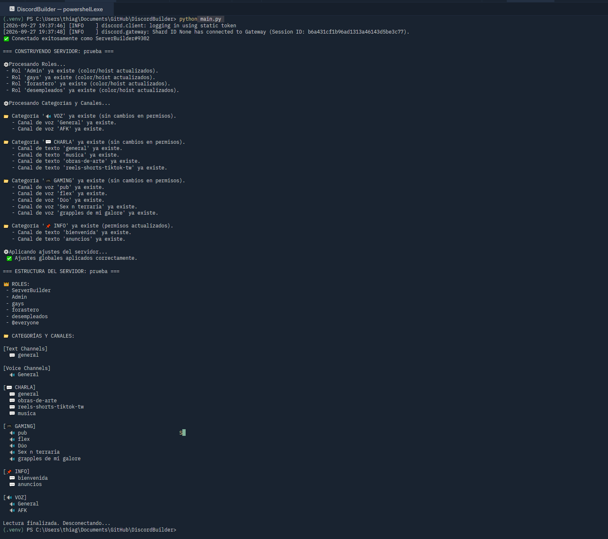

# DiscordBuilder

Arma un server de Discord completo (roles, categorías, canales de texto y voz, permisos y
ajustes del server) a partir de un archivo `server.json`.

Describís **cómo querés que quede** el server y el script hace lo necesario para llegar ahí. Se
puede correr las veces que quieras: lo que ya existe no se duplica, solo se crea lo nuevo.

| El server armado | La salida del script |
|---|---|
|  |  |

En una corrida sobre el server ya armado, todo aparece como *"ya existe"*: no se duplica nada.

## Requisitos

* Python 3.8+ (lo que pide discord.py; probado con 3.14)
* Un bot de Discord invitado a tu server (ver abajo)

```bash
python -m venv .venv
.\.venv\Scripts\Activate.ps1        # Windows (PowerShell)
pip install -r requirements.txt
```

## Configurar el bot

1. En el [Discord Developer Portal](https://discord.com/developers/applications): **New
   Application** → pestaña **Bot** → **Reset Token** y copiá el token.
2. **OAuth2 → URL Generator**: scope **`bot`**, con estos permisos:

   | Permiso         | Para qué                               |
   | --------------- | -------------------------------------- |
   | Manage Roles    | crear roles y aplicar permisos por rol |
   | Manage Channels | crear categorías y canales             |
   | Manage Server   | canal AFK y canal de sistema           |

   No hace falta *Administrator*: el bot pide solo lo que usa. Si el token se filtra, el daño
   queda acotado.
3. Abrí la URL generada e invitá el bot a tu server.
4. Activá el **Modo desarrollador** (Ajustes de usuario → Avanzado). Después, clic derecho sobre
   el server → **Copiar ID del servidor**.
5. Copiá `.env.example` a `.env` y completalo:

   ```
   DISCORD_TOKEN=tu_token
   GUILD_ID=id_de_tu_server
   ```

   El `.env` está en el `.gitignore`. **Nunca subas el token.**

## Uso

Primero mirá qué haría, sin tocar nada:

```bash
python main.py --dry-run
```

Y cuando te convenza:

```bash
python main.py
```

Al terminar imprime la estructura final del server y se desconecta solo.

### Borrar lo que sobra: `--prune`

Por defecto el script nunca borra nada. Con `--prune`, además de crear y actualizar, **borra los
canales, categorías y roles que están en el server pero no en el `server.json`**. Mirá siempre
primero qué borraría:

```bash
python main.py --prune --dry-run
```

Borrar un canal borra todos sus mensajes y no se puede deshacer. Nunca toca `@everyone`, los
roles de bots o integraciones, ni los roles que están a la altura del bot o por encima.

Antes de conectarse, el script **valida el `server.json`**: si falta un `name` o un canal tiene
un `type` inválido, frena sin tocar el server.

## Formato de `server.json`

```json
{
  "server_settings": {
    "system_channel": "bienvenida",
    "afk_channel": "AFK",
    "afk_timeout": 300
  },
  "roles": [
    { "name": "Admin", "hoist": true, "color": "0xFF0000" },
    { "name": "Amigos", "hoist": true }
  ],
  "categories": [
    {
      "name": "💬 CHARLA",
      "channels": [
        { "name": "general", "type": "text", "topic": "de todo un poco" },
        { "name": "Dúo", "type": "voice", "user_limit": 2 }
      ]
    },
    {
      "name": "📌 INFO",
      "overwrites": {
        "@everyone": { "send_messages": false },
        "Admin": { "send_messages": true }
      },
      "channels": [
        { "name": "bienvenida", "type": "text" }
      ]
    }
  ]
}
```

| Campo                     | Obligatorio | Notas                                                                                                                                                  |
| ------------------------- | ----------- | ------------------------------------------------------------------------------------------------------------------------------------------------------ |
| `roles[].name`            | sí          | Nombre del rol                                                                                                                                         |
| `roles[].hoist`           | no          | Mostrar el rol separado en la lista de miembros                                                                                                        |
| `roles[].color`           | no          | Hexadecimal como texto: `"0xFF69B4"`                                                                                                                   |
| `categories[].name`       | sí          | Nombre de la categoría                                                                                                                                 |
| `categories[].overwrites` | no          | Permisos por rol. `@everyone` es el rol que tienen todos. Las claves son permisos de Discord (`send_messages`, `view_channel`...) con `true` o `false` |
| `channels[].name`         | sí          | Nombre del canal. Los canales de texto se normalizan según las reglas de Discord                                                                       |
| `channels[].type`         | sí          | `"text"` o `"voice"`                                                                                                                                   |
| `channels[].topic`        | no          | Solo texto                                                                                                                                             |
| `channels[].user_limit`   | no          | Solo voz                                                                                                                                               |
| `server_settings`         | no          | Canal de sistema, canal AFK y timeout en segundos                                                                                                      |

Los canales se crean sincronizados con los permisos de su categoría.

## Cómo funciona

El flujo general del programa es:

```text
server.json
    │
    ▼
Validación
    │
    ├── ❌ JSON inválido → termina sin tocar Discord
    │
    ▼
Conexión al server
    │
    ▼
Roles
    │
    ▼
Categorías
    │
    ├── Permisos
    │
    ▼
Canales
    │
    ├── Texto
    └── Voz
    │
    ▼
Ajustes del server
    │
    ├── Canal de sistema
    ├── Canal AFK
    └── Timeout AFK
    │
    ▼
Estructura final
```

El archivo `server.json` funciona como la **fuente de verdad** de la configuración que
DiscordBuilder debe aplicar.

### `--dry-run`

El modo `--dry-run` permite validar y analizar la configuración sin realizar cambios en Discord.

```bash
python main.py --dry-run
```

Sirve para comprobar qué roles, categorías y canales detectaría el script antes de ejecutar
cambios reales.

## Por qué es idempotente

DiscordBuilder está diseñado para ser **idempotente**: ejecutar el script varias veces con el
mismo `server.json` no genera duplicados.

Por ejemplo, si el JSON define:

```json
{
  "name": "general",
  "type": "text"
}
```

y el canal `#general` ya existe dentro de la categoría correspondiente, el script lo detecta y
no crea otro.

La idea es:

```text
1ª ejecución:
server vacío
     ↓
crea roles, categorías y canales

2ª ejecución:
server ya configurado
     ↓
detecta lo existente
     ↓
no duplica

3ª ejecución:
misma configuración
     ↓
mismo resultado
```

### ¿Cómo decide si algo ya existe?

Los recursos se buscan por su nombre dentro del contexto correspondiente.

* Los **roles** se buscan por nombre en el server.
* Las **categorías** se buscan por nombre.
* Los **canales** se buscan por nombre dentro de su categoría.
* Si el recurso existe, se reutiliza.
* Si no existe, se crea.

Esto permite que el script sea seguro de ejecutar repetidamente.

### Normalización de nombres

Discord aplica reglas específicas a los nombres de los canales de texto. Por ejemplo:

```text
"obras de arte"
        ↓
"obras-de-arte"
```

Por eso el script no puede asumir que el nombre escrito en `server.json` será exactamente igual
al nombre final almacenado por Discord.

La comparación tiene en cuenta esta normalización para evitar crear un canal duplicado cuando
Discord ya transformó el nombre.

### Permisos

Los permisos de una categoría **solo se modifican cuando la categoría declara
`overwrites` en el JSON**.

Esto es importante porque permite que un server existente conserve sus permisos cuando el JSON
no especifica ninguna configuración para ellos.

Por ejemplo:

```json
{
  "name": "📌 INFO",
  "overwrites": {
    "@everyone": {
      "send_messages": false
    }
  }
}
```

indica explícitamente que esa categoría debe tener ese permiso.

En cambio, una categoría sin `overwrites` no intenta reemplazar los permisos que ya tenga.

### Infraestructura como código

El concepto utilizado es similar al de **Infrastructure as Code (IaC)**.

En lugar de configurar manualmente cada recurso, se describe el estado deseado en un archivo:

```text
server.json
    ↓
estado deseado
    ↓
DiscordBuilder
    ↓
server de Discord
```

El JSON funciona como una configuración reproducible y versionable. Por ejemplo, se puede
guardar en Git y reconstruir la estructura de un server a partir del mismo archivo.

## Limitaciones

* Sin `--prune` no borra lo que está en el server y no figura en el JSON. Solo crea y actualiza.
* Los roles existentes se re-editan en cada corrida (color y `hoist`): manda el JSON.
* Busca los canales por nombre dentro de su categoría. Si renombrás un canal a mano, en la
  próxima corrida se crea de nuevo con el nombre del JSON.
* No administra miembros ni asigna roles automáticamente.
* Con `--prune`, un canal renombrado a mano cuenta como "no está en el JSON" y se borra.
* El bot solo puede modificar recursos sobre los que tenga permisos suficientes.
* Discord mantiene sus propias restricciones sobre nombres, permisos, jerarquía de roles y
  configuración del server.

## Estructura del proyecto

Una estructura esperada del proyecto es:

```text
DiscordBuilder/
├── main.py
├── server.json
├── .env
├── .env.example
├── .gitignore
├── requirements.txt
├── README.md
└── docs/               ← capturas del README
```

### Archivos principales

| Archivo            | Función                                            |
| ------------------ | -------------------------------------------------- |
| `main.py`          | Punto de entrada del programa y lógica principal   |
| `server.json`      | Define el estado deseado del server                |
| `.env`             | Guarda el token del bot y el ID del server         |
| `.env.example`     | Plantilla para configurar las variables de entorno |
| `requirements.txt` | Dependencias de Python                             |
| `.gitignore`       | Evita subir archivos sensibles o innecesarios      |
| `README.md`        | Documentación del proyecto                         |

## Ejemplo completo

Un `server.json` mínimo puede ser:

```json
{
  "roles": [
    {
      "name": "Admin",
      "hoist": true,
      "color": "0xFF0000"
    },
    {
      "name": "Amigos",
      "hoist": true
    }
  ],
  "categories": [
    {
      "name": "💬 CHARLA",
      "channels": [
        {
          "name": "general",
          "type": "text",
          "topic": "de todo un poco"
        },
        {
          "name": "Gaming",
          "type": "voice",
          "user_limit": 5
        }
      ]
    }
  ]
}
```

Después:

```bash
python main.py --dry-run
```

Si la configuración es correcta:

```bash
python main.py
```

El resultado será un server con la estructura definida en el JSON, sin crear duplicados si se
vuelve a ejecutar el programa.

## Stack

Python · [discord.py](https://github.com/Rapptz/discord.py) 2.7 · python-dotenv · argparse
